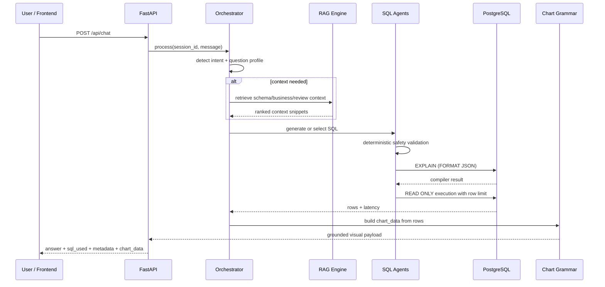
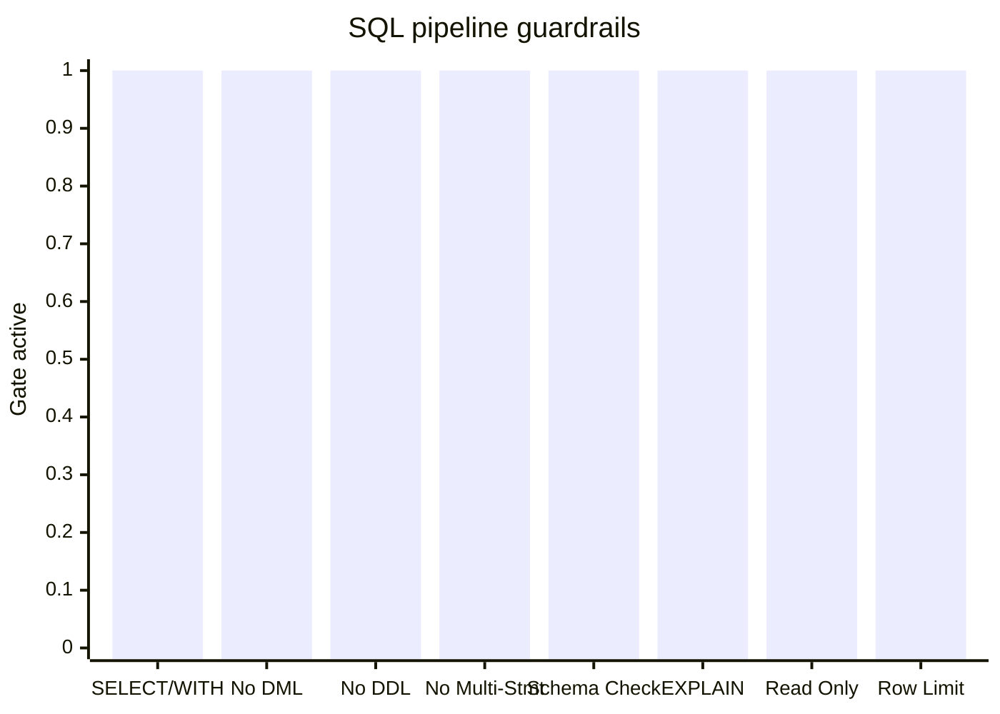
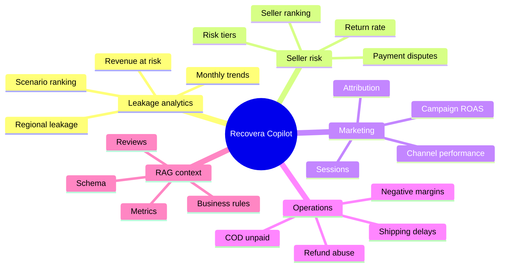
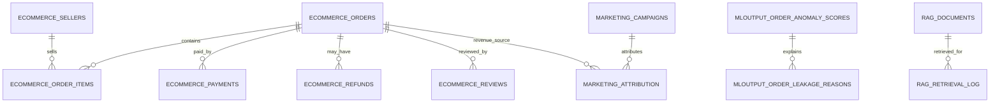
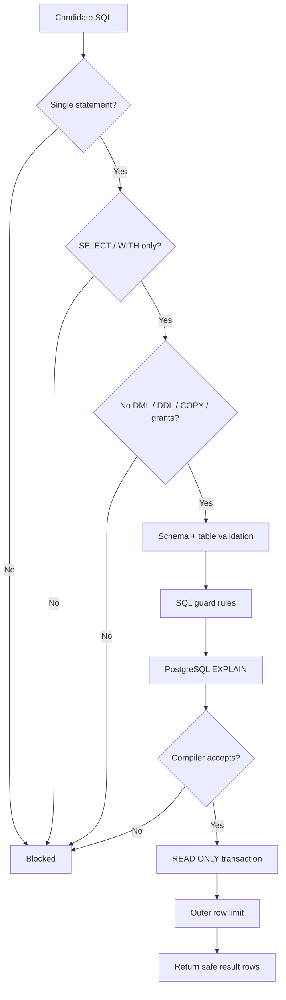
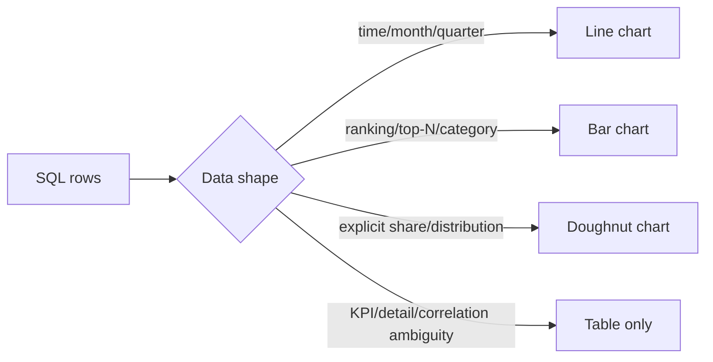
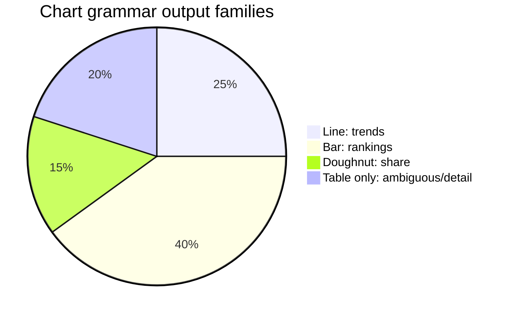

<div align="center">

# Recovera Backend 

**Backend-only AI analytics copilot for revenue leakage detection.**  
Recovera turns natural-language business questions into safe, validated PostgreSQL analytics using FastAPI, multi-agent SQL orchestration, RAG retrieval, deterministic question routing, read-only execution, query caching, and grounded `chart_data` for frontend visualizations.

<p>
  
  
  
  
  
</p>

[Quick Start](#-quick-start) · [Architecture](#-architecture) · [API](#-api-surface) · [Database](#-database-contract) · [Testing](#-testing) · [Security](#-security-model)

</div>

---

## ✦ What This Backend Does

Recovera is a **Revenue Leakage AI Copilot**: it answers questions about leakage, sellers, refunds, marketing, orders, reviews, and operational risk by combining deterministic routing, RAG context, safe SQL generation, PostgreSQL compiler validation, and grounded chart grammar.

> This repository is **backend-only**. `main.py` can optionally serve static frontend files if a `static/` build exists, but the product logic here is the FastAPI analytics backend.

---

## ✦ Key Features

| Capability | What it does |
|---|---|
| **FastAPI API** | Session, chat, copilot alias, history, health, stats, and root endpoints. |
| **Multi-agent orchestration** | Planner → retrieval → SQL generation/template → validation → execution → interpretation → charting. |
| **SQL generation** | Uses deterministic templates for known question families and LLM SQL generation for flexible analytics. |
| **Deterministic SQL safety** | Blocks unsafe SQL before it reaches the database. |
| **PostgreSQL `EXPLAIN` validation** | Uses the database compiler to verify SQL structure before execution. |
| **Read-only execution** | Executes inside read-only transactions with statement timeout and row limits. |
| **Dynamic schema registry** | Loads schema from live DB first, exported JSON fallback second. |
| **RAG retrieval** | Retrieves business, review, schema, metric, and SQL context using Jina embeddings. |
| **Question-pattern routing** | Handles recurring business questions through deterministic profiles/templates. |
| **Grounded chart grammar** | Converts SQL rows into stable frontend `chart_data`. |
| **Query result caching** | Uses `rag.query_result_cache` to reduce repeated execution cost. |
| **Golden regressions** | Validates deterministic coverage using golden questions and chart grammar tests. |

---

## ✦ Architecture

```mermaid
flowchart LR
    Q([User Question]) --> P[Intent / Question Profile]
    P --> A[Planner Agent]
    A --> R{Needs RAG?}
    R -- Yes --> V[RAG Retrieval<br/>business · schema · reviews · metrics]
    R -- No --> S[SQL Route]
    V --> S
    S --> T{Known Pattern?}
    T -- Template --> D[Deterministic SQL Template]
    T -- Flexible --> G[SQL Generator Agent]
    D --> X[SQL Safety Validator]
    G --> X
    X --> E[PostgreSQL EXPLAIN Check]
    E --> O[Read-only Query Executor]
    O --> I[Analytics Interpreter]
    I --> C[Chart Grammar]
    C --> API([API Response])
```



<details open>
<summary><strong>Pipeline as compact sequence</strong></summary>



</details>

### Safety gate coverage



### Question routing map



---

## ✦ Repository Structure

```text
.
├── main.py                         # FastAPI app, endpoints, startup hooks
├── pyproject.toml                  # Package metadata + dependencies
├── .env.example                    # Runtime configuration template
├── app/
│   ├── agents/                     # SQL generation, validation, safety, compile, execute, interpret
│   ├── core/                       # Orchestrator, config, routing, chart grammar, schema registry
│   ├── database/                   # asyncpg pool, schema loading, SQL guard, health/history/cache
│   └── retrieval/                  # Jina embeddings + RAG retrieval engine
├── data/
│   ├── db_schema/                  # Exported schema JSON fallback + database documentation
│   └── evaluation/                 # Golden questions for regression checks
└── tests/                          # Safety, routing, chart grammar, executor contract, golden coverage
```

| Area | Main files |
|---|---|
| **API** | `main.py` |
| **Orchestration** | `app/core/orchestrator.py` |
| **Config** | `app/core/config.py` |
| **Routing** | `app/core/question_patterns.py`, `app/core/intent_classifier.py` |
| **Chart grammar** | `app/core/chart_grammar.py` |
| **Schema registry** | `app/core/schema_registry.py` |
| **SQL agents** | `app/agents/sql_generator.py`, `sql_validator.py`, `sql_safety.py`, `sql_compiler.py`, `query_executor.py` |
| **Retrieval** | `app/retrieval/retrieval_engine.py` |
| **Database** | `app/database/postgres.py` |
| **Database docs** | `data/db_schema/DATABASE_DOCUMENTATION.md` |
| **Regression data** | `data/evaluation/golden_questions.json` |

---

## ✦ Tech Stack

| Layer | Tools |
|---|---|
| API | Python 3.11+, FastAPI, Uvicorn, Pydantic v2 |
| Database | PostgreSQL / Supabase, asyncpg |
| SQL validation | sqlglot, deterministic safety checks, PostgreSQL `EXPLAIN` |
| AI calls | Groq, OpenRouter, httpx |
| Embeddings / RAG | Jina AI embeddings |
| Config | python-dotenv |
| Testing | pytest, pytest-asyncio, coverage |

---

## ✦ Quick Start

<details open>
<summary><strong>macOS / Linux</strong></summary>

```bash
python -m venv .venv
source .venv/bin/activate
pip install -e .
cp .env.example .env
uvicorn main:app --reload
```

</details>

<details>
<summary><strong>Windows PowerShell</strong></summary>

```powershell
python -m venv .venv
.venv\Scripts\Activate.ps1
pip install -e .
copy .env.example .env
uvicorn main:app --reload
```

</details>

<details>
<summary><strong>Development install</strong></summary>

```bash
pip install -e ".[dev]"
pytest -q
```

</details>

Default local API:

```text
http://localhost:8000
```

---

## ✦ Environment Variables

Create `.env` from `.env.example`. Do not commit it.

```bash
cp .env.example .env
```

<details open>
<summary><strong>Required service keys</strong></summary>

| Variable | Purpose |
|---|---|
| `JINA_API_KEY` | Embedding generation for RAG retrieval. |
| `GROQ_API_KEY` | Planner model calls. |
| `OPENROUTER_API_KEY_1` | Primary OpenRouter key for SQL/validator/analytics models. |
| `OPENROUTER_API_KEY_2` | Secondary fallback OpenRouter key. |
| `OPENROUTER_API_KEY_3` | Third fallback OpenRouter key. |

</details>

<details>
<summary><strong>Models</strong></summary>

| Variable | Default |
|---|---|
| `JINA_MODEL` | `jina-embeddings-v5` |
| `JINA_EMBED_DIM` | `1024` |
| `GROQ_MODEL` | `llama-3.3-70b-versatile` |
| `MODEL_SQL` | `z-ai/glm-4.5-air:free` |
| `MODEL_VALIDATOR` | `deepseek/deepseek-v4-flash:free` |
| `MODEL_ANALYTICS` | `minimax/minimax-m2.5:free` |
| `VALIDATOR_LLM_ENABLED` | `false` |

Keep `VALIDATOR_LLM_ENABLED=false` unless an optional LLM critic is explicitly needed. Deterministic validation remains the primary safety mechanism.

</details>

<details>
<summary><strong>Database</strong></summary>

| Variable | Default | Purpose |
|---|---:|---|
| `DB_HOST` | `localhost` | PostgreSQL/Supabase host. |
| `DB_PORT` | `5432` | PostgreSQL/Supabase port. |
| `DB_NAME` | `revenue_leakage` | Database name. |
| `DB_USER` | `chatbot_readonly` | Recommended read-only database user. |
| `DB_PASSWORD` | empty | Database password. |
| `DB_POOL_MIN` | `2` | Minimum asyncpg pool size. |
| `DB_POOL_MAX` | `10` | Maximum asyncpg pool size. |

</details>

<details>
<summary><strong>Runtime</strong></summary>

| Variable | Default | Purpose |
|---|---:|---|
| `STATEMENT_TIMEOUT_MS` | `15000` | Per-query timeout. |
| `MAX_QUERY_ROWS` | `200` | API row cap. |
| `QUERY_CACHE_TTL_SECONDS` | `86400` | Query result cache TTL. |
| `SCHEMA_CACHE_TTL_SECONDS` | `3600` | Schema metadata cache TTL. |
| `EMBED_CACHE_TTL_SECONDS` | `300` | Embedding cache TTL. |
| `ENVIRONMENT` | `development` | Runtime environment. |
| `LOG_LEVEL` | `INFO` | Logging level. |
| `CORS_ORIGINS` | `http://localhost:3000,http://localhost:5173` | Allowed origins. |

</details>

---

## ✦ API Surface

| Method | Endpoint | Purpose |
|---|---|---|
| `POST` | `/api/session` | Create a new chat session. |
| `POST` | `/api/chat` | Main AI copilot pipeline. |
| `POST` | `/api/copilot` | Compatibility alias for `/api/chat`. |
| `GET` | `/api/history/{session_id}` | Load recent conversation history. |
| `GET` | `/api/health` | Database/model/config health snapshot. |
| `GET` | `/api/stats` | Router key stats and embedding dimension. |
| `GET` | `/` | Optional static frontend or API fallback page. |

<details open>
<summary><strong>Create a session</strong></summary>

```bash
curl -X POST http://localhost:8000/api/session
```

```json
{
  "session_id": "8d6b92e1-61e0-4e8f-942f-36e3f3d9d7c1"
}
```

</details>

<details open>
<summary><strong>Ask a revenue leakage question</strong></summary>

```bash
curl -X POST http://localhost:8000/api/chat \
  -H "Content-Type: application/json" \
  -d '{
    "session_id": "8d6b92e1-61e0-4e8f-942f-36e3f3d9d7c1",
    "message": "What are the top leakage scenarios by revenue?"
  }'
```

`message`, `query`, `text`, and `content` are accepted as equivalent input fields.

</details>

---

## ✦ Chat Response Shape

```json
{
  "session_id": "8d6b92e1-61e0-4e8f-942f-36e3f3d9d7c1",
  "answer": "The highest leakage concentration is driven by...",
  "sql_used": "SELECT ...",
  "row_count": 10,
  "execution_ms": 214,
  "error": null,
  "steps": ["Detected intent", "Validated SQL", "Executed read-only query"],
  "intent": "leakage_detection",
  "route": "sql_only",
  "difficulty": "medium",
  "rag_retrieved": 0,
  "rag_cached": false,
  "total_tokens_in": 1432,
  "total_tokens_out": 408,
  "confidence": 0.94,
  "chart_data": {
    "type": "bar",
    "title": "Leakage scenarios",
    "labels": ["shipping_failed_return_exists", "negative_profit_margin"],
    "datasets": [
      {
        "label": "Leakage revenue",
        "data": [2807503.36, 1932000.12],
        "unit_family": "money",
        "value_prefix": "EGP ",
        "value_format": "compact"
      }
    ],
    "chart_grammar_applied": true
  }
}
```

| Field | Description |
|---|---|
| `session_id` | Current conversation session. |
| `answer` | Natural-language analytics answer. |
| `sql_used` | SQL that produced the answer, when applicable. |
| `row_count` | Returned row count after row limiting. |
| `execution_ms` | SQL execution latency. |
| `error` | Pipeline/SQL error if one occurred. |
| `steps` | Human-readable execution trace. |
| `intent` | Detected analytical intent. |
| `route` | Selected path, e.g. SQL-only, RAG-only, hybrid, template. |
| `difficulty` | Estimated query complexity. |
| `rag_retrieved` | Number of retrieved RAG context items. |
| `rag_cached` | Whether retrieval used cache. |
| `total_tokens_in/out` | Token accounting across LLM calls. |
| `confidence` | Operational confidence score. |
| `chart_data` | Deterministic frontend visualization payload. |

---

## ✦ Database Contract

Business schemas expected by the analytics layer:

```text
ecommerce
marketing
ml_output
rag
```

Preferred materialized views:

```text
ml_output.mv_leakage_dashboard
ml_output.mv_monthly_leakage
ml_output.mv_seller_risk
ml_output.mv_leakage_by_scenario
```



Important assumptions:

- Monetary values are **EGP**.
- Business data should be queried through a read-only role.
- `rag.query_result_cache` is assumed to already exist.
- `rag.retrieval_cache` supports retrieval caching.
- `rag.sql_guard` can provide additional regex guardrails.
- Exported JSON files under `data/db_schema/` are schema-registry fallback inputs.

---

## ✦ SQL Safety Model



Rules enforced:

- Only `SELECT` / `WITH` analytics queries are allowed.
- DML, DDL, `COPY`, permission changes, and multiple statements are blocked.
- Schema/table access is validated against the dynamic registry.
- PostgreSQL `EXPLAIN` validates SQL before execution.
- Execution runs in a `READ ONLY` transaction.
- Statement timeouts and row limits remain enabled.

---

## ✦ Grounded Chart Grammar

`app/core/chart_grammar.py` converts returned rows into conservative `chart_data`.





Design constraints:

- A chart uses one coherent metric family: money, rate, count, or duration.
- Rankings become bar charts.
- Time trends become line charts.
- Explicit distribution/share questions can become doughnut charts.
- KPI/detail/correlation ambiguity can return table-only.
- `chart_data` is a visual summary, not a replacement for the full result set.

---

## ✦ Testing

```bash
pytest -q
```

```bash
PYTHONPATH=. python -m app.core.golden_evaluator
```

```bash
PYTHONPATH=. pytest -q tests/test_chart_grammar.py tests/test_golden_question_coverage.py
```

Focused safety checks:

```bash
PYTHONPATH=. pytest -q tests/test_sql_safety.py
PYTHONPATH=. pytest -q tests/test_sql_validator.py
PYTHONPATH=. pytest -q tests/test_query_executor_contract.py
```

---

## ✦ Development Notes

| Recommendation | Reason |
|---|---|
| Keep `VALIDATOR_LLM_ENABLED=false` by default. | Deterministic validation and PostgreSQL compilation are the safety gates. |
| Prefer materialized views before base-table joins. | Faster, more stable, less schema drift. |
| Do not use `LIKE` on `review_comment`. | Use RAG retrieval for text/review search. |
| Avoid `SELECT *`. | Keeps payloads small and chart grammar predictable. |
| Keep timeout and row limits enabled. | Prevents runaway execution. |
| Treat `chart_data` as a summary. | Full rows remain the source of truth. |

---

## ✦ Production Readiness

```text
[ ] Python 3.11+ runtime
[ ] .env configured outside source control
[ ] Read-only DB role configured
[ ] PostgreSQL/Supabase reachable
[ ] Jina, Groq, and OpenRouter keys configured
[ ] CORS restricted to trusted origins
[ ] STATEMENT_TIMEOUT_MS enabled
[ ] MAX_QUERY_ROWS enabled
[ ] pytest -q passes
[ ] Golden evaluator passes
[ ] /api/health returns expected status
```

<details>
<summary><strong>Known assumptions</strong></summary>

- Python 3.11+ is required.
- PostgreSQL/Supabase must be available for live API usage.
- API keys must be configured for model and embedding calls.
- Exported schema JSON can be used as schema-registry fallback.
- `rag.query_result_cache` is expected to exist.
- This is a backend-only bundle.
- Some internal API metadata still reports `version="7.0.0"`; the repository bundle is the v9 Grounded Charts backend build.

</details>

---

## ✦ Security Model

| Control | Status |
|---|---|
| `.env` excluded from source control | Required |
| Read-only DB role | Strongly recommended |
| CORS restricted in production | Required |
| API keys rotated periodically | Recommended |
| SQL timeout enabled | Required |
| Row limit enabled | Required |
| SQL compiler validation | Required |
| Query logs reviewed before exposure | Recommended |

Security rules:

- Never commit `.env`.
- Use a read-only DB role for business schemas.
- Store production secrets in a managed secret store.
- Restrict `CORS_ORIGINS` in production.
- Rotate API keys if they are exposed.
- Keep SQL guard rules and schema registry active.

---

## ✦ License

Not specified.

---

## ✦ Status

**Backend-only v9 Grounded Charts build** for the Recovera Revenue Leakage AI Copilot.

</div>
